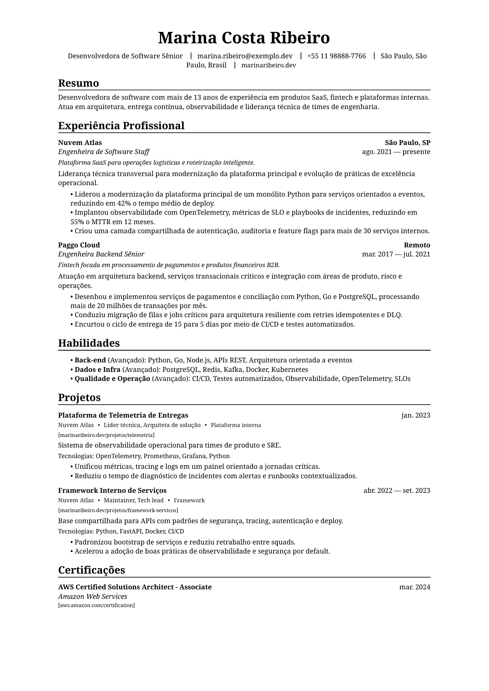

# SoftWorker

Biblioteca Python para gerar currículos ATS-friendly em PDF a partir de dados estruturados em JSON.

Em termos simples: você preenche os dados do currículo em um arquivo estruturado, roda um comando e o projeto cria um PDF pronto para usar. O layout foi pensado para ser legível por pessoas e por sistemas de triagem de currículos (ATS).

## Prévia

Primeira página do PDF gerado com o exemplo do projeto:



## O que o projeto faz

- Lê um arquivo JSON no formato JSON Resume.
- Monta o currículo em HTML com templates separados por seção.
- Converte esse HTML em um PDF A4.
- Gera o PDF com tags de acessibilidade (`pdf/ua-1`).

## Como testar rápido

Instale as dependências:

```bash
uv sync
```

Gere o PDF usando o exemplo principal:

```bash
uv run python -m softworker docs/sample-resume.json
```

O arquivo gerado fica no diretório atual com o mesmo nome do JSON:

```text
sample-resume.pdf
```

Se quiser escolher o nome ou o caminho de saída:

```bash
uv run python -m softworker docs/sample-resume.json /tmp/currículo.pdf
```

Se quiser renderizar o tema em outro idioma:

```bash
uv run python -m softworker docs/sample-resume.json /tmp/resume.pdf --resume-language en_US
```

## O que você precisa ter

- Python 3.13+
- `uv`
- Dependências nativas do WeasyPrint instaladas no sistema

## Arquivos mais importantes

- `docs/sample-resume.json`: exemplo principal para testar
- `docs/sample-resume-full.json`: exemplo mais completo
- `docs/schema.json`: referência do formato esperado
- `src/softworker/`: código Python da renderização
- `theme/`: templates HTML e CSS do currículo

## Como o fluxo funciona

1. Você passa um arquivo JSON com os dados do currículo.
2. O projeto renderiza esse conteúdo com o tema HTML.
3. O HTML é convertido em PDF.

## Uso como biblioteca

Também dá para usar direto no Python:

```python
import json
from pathlib import Path
from typing import Dict, Any
from softworker import render_pdf_from_dict
from softworker.enums import ResumeLanguage

resume_path, output_path = Path("docs/examples/resume.json"), Path("resume.pdf")
resume: Dict[str, Any] = json.loads(resume_path.read_text(encoding="utf-8"))
pdf: bytes = render_pdf_from_dict(resume, resume_language=ResumeLanguage.PT_BR)
output_path.write_bytes(pdf)
```

## Seções suportadas

O tema atual entende estas seções do JSON Resume:

- `basics`
- `work`
- `skills`
- `projects`
- `certificates`
- `awards`
- `education`
- `languages`
- `profiles`
- `publications`
- `volunteer`
- `interests`
- `references`
